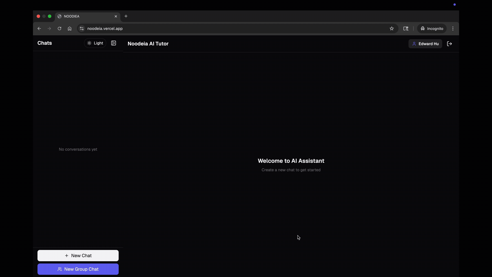
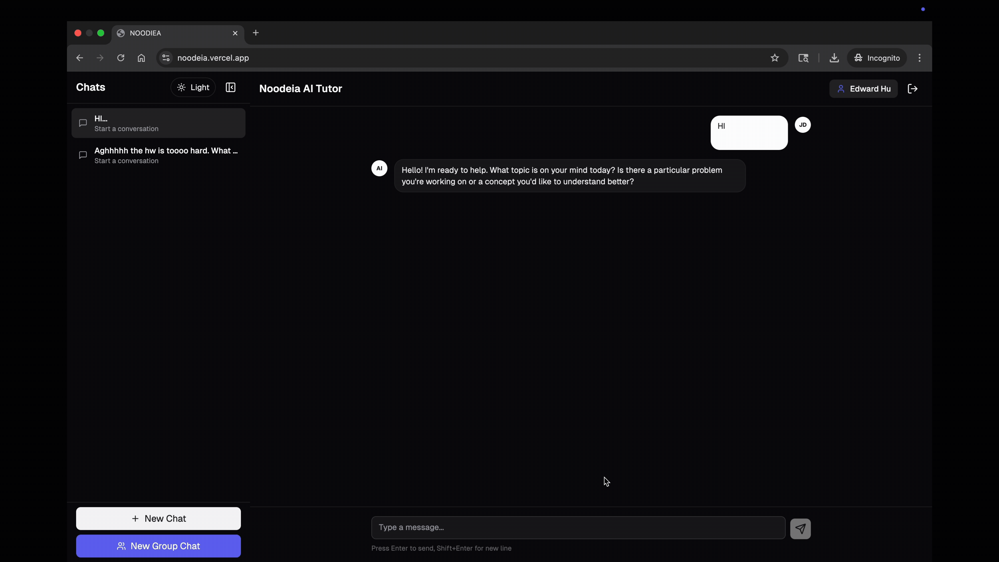

# Get Familiar With NOODIEA AI 

## Sign Up Demonstration


## Log In Demonstration


## Log Out Demonstration


## NOODIEA AI Tutor Demonstration


## Create Group Chat Demonstration


## Join And Leave Group Chat Demonstration


## NOODIEA AI Tutor In Group Chat Demonstration


## Scratch Paper Extension Demonstration


## Build Personalized Teaching Assistant Demonstration


## Personalized Teaching Assistant With Voice Assistance Demonstration


# Explore NOODIEA Interface

## Rename And Delete Chat


## Switch Theme 


## Resend And Edit


## Minimize Chat Bar


## Mobile And Tablet


# Low Latency

We utilize the graph database Neo4j instead of the traditional SQL or NOSQL database, which significantly increases the query speed as it connects all the related information through relationships between nodes rather than countless JOIN statements. 

It also supports other features that traditional SQL database can not achieve such as context aware AI assistant in the groupchat and memory enhanced AI assistant

## SQL vs Neo4j 

### Syntax Comparison

Query: Get all recipes containing “Bacon” from the “Italian” Cuisine

#### SQL Syntax

```

SELECT DISTINCT recipes
FROM Recipes IN Recipe TABLE
JOIN MeatRecipe IN MeatRecipe TABLE
ON RecipesId EQUALS MeatRecipe.RecipeId
WHERE MeatRecipe.MeatId EQUALS “Bacon”
JOIN RecipeCuisine IN RecipeCuisine TABLE
ON RecipesId EQUALS RecipeCuisine.RecipeId
WHERE RecipeCuisine.CuisineId EQUALS “Italian”

```

#### Neo4j Syntax

```

MATCH (Recipe)- [CONTAINS MEAT]-> (Meat {"Bacon"}),
(Recipe)- [IS_FROM_CUISINE]-> (Cuisine {"Italian"})
return Distinct Recipe

```


### Query Speed Comparison

Consider 1000000 people each with 50 friends, find the friends of a friend network and their information


# High Accuracy

We implement the [current SOTA model Gemini 2.5 Pro based on Vellum](https://www.vellum.ai/llm-leaderboard?utm_source=google&utm_medium=organic) that excels in math and reasoning compared to the most commonly used ChatGPT-4o 


# Safety 

We incorporate JWT in our authentication system. When a request arrives, the server can quickly verify the signature of the token and read the claims to authorize the user instead of querying in the database for authorization information on every request.

Since we deploy our database in graph database Neo4j, we are immune to various cyber attacks like SQL injection.